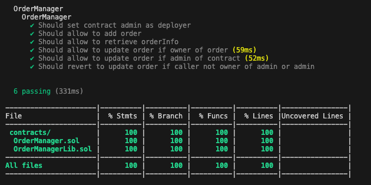

# OrderManager Smart Contract

The OrderManager Smart Contract is a Solidity smart contract that enables the management of orders. It provides functions to add new orders, retrieve order information, and update the status of orders. This project is developed using Hardhat, a popular development framework for Ethereum.

## Table of Contents

- [Prerequisites](#prerequisites)
- [Getting Started](#getting-started)
  - [Installation](#installation)
  - [Running Tests](#running-tests)
- [Usage](#usage)
  - [Deploying the Contract](#deploying-the-contract)

## Prerequisites

To use and run this project, you need to have the following prerequisites:

- Node.js (v12 or higher)
- Hardhat

## Getting Started

### Installation

1. Clone this repository to your local machine.
2. Install the required dependencies by running the following command:

```console
npm install
```  

## Running Tests

   ```bash
   npx hardhat test
   ```

This command will execute the test suite defined in the project and display the test results.

### Checking Coverage

   ```bash
   npx hardhat coverage
   ```

This command will check to coverage of tests and generate coverage dir.

Coverage is 100%




## Generating Documentation

   ```bash
  npx hardhat dodoc
   ```

Dodoc is compatible with all the NatSpec tags (except custom ones for now), and can generate documentation for events, custom errors and external / public functions.

By default Dodoc generates new documentation after each compilation, but you can also trigger the task with the following command:

## Usage
### Deploying the Contract
To deploy the OrderManager Smart Contract, follow these steps:

Open the deploy.js file located in the scripts directory.
Modify the deployment script according to your deployment requirements.
Save the file.
To deploy the contract, run the following command:

```bash
npx hardhat run scripts/deploy.ts
```